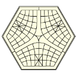

# sigma-app

Multi-platform applications are named 'ΣigmaApp'

Releases:

| | SWF | Web | Desktop | Android | iOS (need jailbreak) |
|---|---|---|---|---|---|
|  | | | DuxiuDown | DuxiuLite (AIR+ANE) | DuxiuLite (AIR+ANE) for iOS5   DuxiuApp (Objective-C) for iOS5/6 |
|  | [2D](http://cailiangsheng.github.io/xpchess/bin/web/XpChessWeb.swf)   [Flash3D](http://cailiangsheng.github.io/xpchess/bin/web/XpChessWeb3D.swf)   [Stage3D](http://cailiangsheng.github.io/xpchess/bin/web/XpChessWebStage3D.swf) | [2D](http://cailiangsheng.github.io/xpchess/bin/web/XpChessWeb.html)   [Flash3D](http://cailiangsheng.github.io/xpchess/bin/web/XpChessWeb3D.html)   [Stage3D](http://cailiangsheng.github.io/xpchess/bin/web/XpChessWebStage3D.html) | 2D   Flash3D   Stage3D | 2D  Stage3D | 2D   Stage3D |
